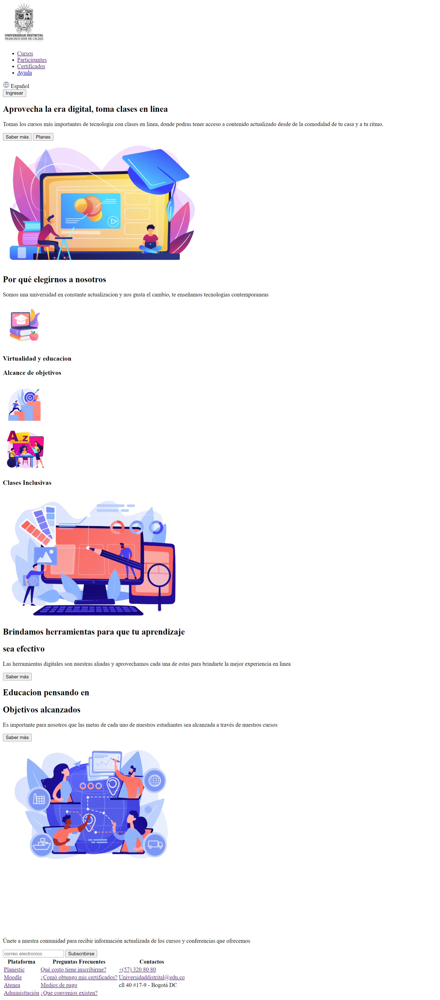

<h1>Taller 9 Maicol Villarruel Leal</h1>

<h2> Información</h2>

Curso: full Stack Basico - Grupo 1

Profesor: Cristian Patiño

<h2> Punto 1: Link figma</h2>

<a href="https://www.figma.com/file/zheezrbh65BLAoGnN5rZJV/Maicol--Villarruel--Poyecto-figma.?type=design&node-id=4%3A260&mode=design&t=WH2ve3FSVI5OKzxu-1" target="_blank">Link de Figma</a>

<h2>Punto 2: HTML <h2>

